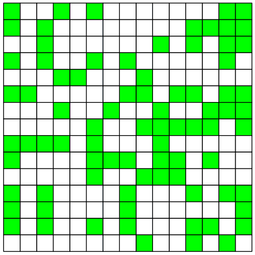
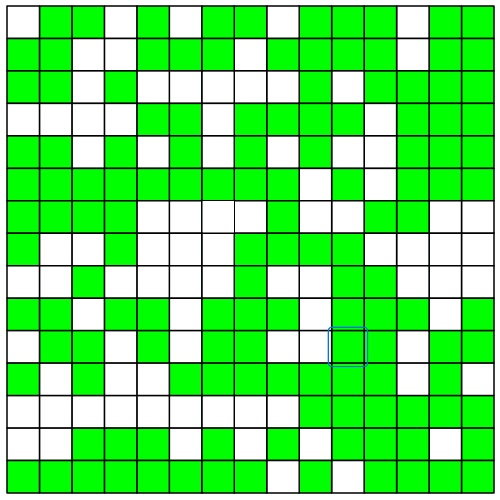
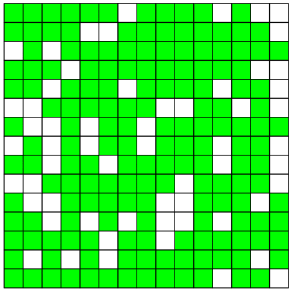

# 🔥 Forest Fire Simulation – Maple

 

> A cellular automaton simulation of fire spreading through a 2D forest.  
> Trees are randomly placed with a given density, fire starts at the center, and at each step it spreads to the four orthogonal neighbors (up, down, left, right).  
> Burning trees turn to ash, and ash disappears over time.

---

## ✨ Features
- Random forest generation with custom tree density (e.g., 60%)
- Color coding:
  - 🟢 Green = Tree
  - 🔴 Red = Fire
  - ⚫ Gray = Ash
  - ⚪ White = Empty ground
- Fire spreads only to adjacent trees (4‑neighbor rule)
- Burning trees become ash, then empty ground
- Step‑by‑step animation that can be exported as GIF

---

## 🖼 Sample Output (40%, 60%, and 80% density)



> *Above: 15×15 forest with 40% density – fire spreads but may not consume all trees due to low density.*



> *Above: 15×15 forest with 60% density – fire spreads steadily and consumes most of the forest.*



> *Above: 15×15 forest with 80% density – fire quickly spreads and burns almost the entire forest.*
---

## 📁 Code Structure (main functions)

| Function | Description |
|----------|-------------|
| `init(n, p)` | Generate initial forest of size n×n with tree density p (0–100) |
| `putfire(T, r, c)` | Ignite cell (r,c) in forest T |
| `checkfire(T, r, c)` | Check if cell (r,c) is adjacent to any fire |
| `newconfig(T)` | Perform one simulation step and return new state |
| `Display(T)` | Display forest graphically with appropriate colors |
| `animation(n, nb, p)` | Run full animation: size n, number of frames nb, density p (0–1) |

---

## 🚀 How to Run

1. Open `forest_fire.mw` in Maple.
2. Load required packages (already included in the code):
   ```maple
   with(plots): with(geometry): with(plottools):
   ```
3. Run a simple animation:
    ```maple
    animation(15, 40, 0.67);   # 15×15 forest, 40 frames, 67% density
    ```
    > Note: `animation` expects `p` as a decimal (0 to 1). For example, `0.6` means 60% density.
4. The output will appear as an animation in Maple. To save it as a GIF, use Export -> GIF.

## 📊 Simulation Step Details

| State | Color | Behavior |
|-------|-------|----------|
| 0 | White | Empty – nothing happens |
| 1 | Green | Tree – ignites if adjacent to fire |
| 2 | Gray | Ash – stays unchanged (becomes 0 in next frame) |
| 3 | Red | Fire – becomes ash (2) in next frame |

Algorithm:
1. Ignite the center of the forest.
2. In each step, every burning cell ignites its four orthogonal neighbors if they contain a tree.
3. Burning cells turn to ash (2).
4. Ash turns to empty ground (0) in the following step.
5. The animation stops when no trees are left or the specified frame count is reached.

---

## 🧪 Experiment with Different Densities

- Low density (e.g., 40%): Fire dies out quickly.
- High density (e.g., 80%): Fire consumes almost the entire forest.
- 67% density: An interesting point – fire spreads slowly but steadily (as shown in the sample GIF).

Try this in Maple:
```maple
animation(20, 60, 0.5);   # 20×20 forest, 50% density
```
## 📥 Prerequisites

- Maple 2023 or newer (older versions may also work)
- Packages `plots`, `geometry`, `plottools` (all come pre‑installed with Maple)

---

## 👤 Author

Mohammad Javad Abdolahi – University project for Programming with Maple Dr. Amir Hashemi – February 2023

---

## 📜 License

This project is licensed under the MIT License – free to use, modify, and distribute.

---

> 🌟 If you like this project, please **⭐ Star** the repository!

---

## 🔗 Related Projects

- [Conway's Game of Life (Maple)](https://github.com/JavadAbdollahi/University-Projects/blob/main/Game-of-Life)
- [Hanoi Tower Animation (Maple)](https://github.com/JavadAbdollahi/University-Projects/blob/main/Hanoi-Tower)
