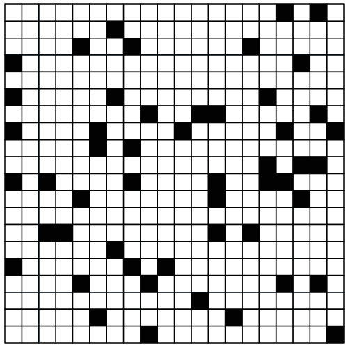
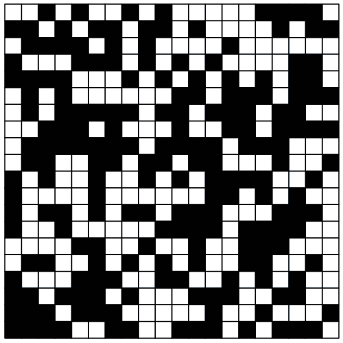
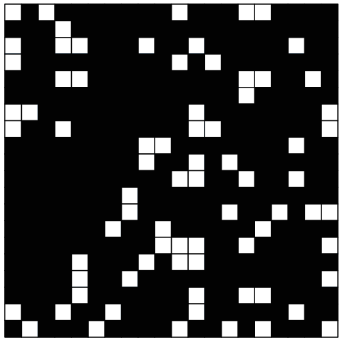

# 🧬 Game of Life (Conway's Game of Life) – Maple

 

> An implementation of Conway's Game of Life, a cellular automaton devised by mathematician John Conway.  
> The simulation evolves on a 2D grid where each cell is either **alive (black)** or **dead (white)**.  
> The next generation is determined solely by the state of the eight neighboring cells.

---

## ✨ Features
- Random initial grid with adjustable density (0–100%)
- Conway's original rules:
  - **Survival:** A live cell with 2 or 3 live neighbors stays alive.
  - **Death:** A live cell with fewer than 2 or more than 3 live neighbors dies.
  - **Birth:** A dead cell with exactly 3 live neighbors becomes alive.
- 8‑neighbor connectivity (including diagonals)
- Graphical display with black (alive) and white (dead) cells
- Step‑by‑step animation over multiple generations

---

## 🖼 Sample Output (15%, 50%, and 85% initial density)



> *Above: 20×20 grid with 15% initial alive cells – many isolated cells die, some patterns emerge.*



> *Above: 20×20 grid with 50% initial alive cells – clusters form and evolve over generations.*



> *Above: 20×20 grid with 85% initial alive cells – high density leads to chaotic behavior and eventual stabilization.*

---

## 📁 Code Structure (main functions)

| Function | Description |
|----------|-------------|
| `init(n, density)` | Creates an n×n grid with random alive cells based on density (0–100) |
| `count_neighbors(grid, i, j)` | Returns the number of live neighbors (8 directions) for cell (i,j) |
| `next_gen(grid)` | Applies Conway's rules to produce the next generation |
| `display_grid(grid)` | Renders the grid graphically (black = alive, white = dead) |
| `animate_game(n, gens, density)` | Runs the simulation for `gens` generations and displays an animation |

---

## 🚀 How to Run

1. Open the Maple file (e.g., `game_of_life.mw`) in Maple.
2. Load the required packages (already included):
   ```maple
   with(plots): with(plottools):
   ```
3. Run the animation with your desired parameters:
   ```maple
   animate_game(20, 50, 40);   # 20×20 grid, 50 generations, 40% initial density
   ```
4. The output appears as an animation. To save as a GIF, use Export -> GIF.

---

## 📊 Simulation Rules (Conway's original)

| Current state | Live neighbors | Next state |
|---------------|----------------|-------------|
| Alive (1)     | 0 or 1         | Dead (0) – underpopulation |
| Alive (1)     | 2 or 3         | Alive (1) – survival |
| Alive (1)     | 4–8            | Dead (0) – overpopulation |
| Dead (0)      | 3              | Alive (1) – birth |
| Dead (0)      | otherwise      | Dead (0) |

**Neighborhood:** all 8 surrounding cells (horizontal, vertical, diagonal).

---

## 🧪 Experiment with Different Densities

- **Low density (e.g., 0–20%):** Most cells die quickly; only a few stable patterns may remain.
- **Medium density (e.g., 40–60%):** Interesting oscillators, gliders, and still lifes can appear.
- **High density (e.g., 80–100%):** Initial chaos often leads to rapid stabilization or extinction.

You can also create **custom patterns** by modifying the initial grid (e.g., a glider, blinker, or block).

---

## 📥 Prerequisites

- Maple 2023 or newer (older versions may work)
- Packages `plots` and `plottools` (pre‑installed with Maple)

---

## 👤 Author

Mohammad Javad Abdolahi – University project for Programming with Maple, Dr. Amir Hashemi – February 2023

---

## 📜 License

This project is licensed under the MIT License – free to use, modify, and distribute.

---

> 🌟 If you like this project, please **⭐ Star** the repository!

---

## 🔗 Related Projects

- [Forest Fire Simulation (Maple)](https://github.com/javadabdolahi/University-Projects/Forest-Fire-Simulation)
- [Hanoi Tower Animation (Maple)](https://github.com/javadabdolahi/University-Projects/Hanoi-Tower)